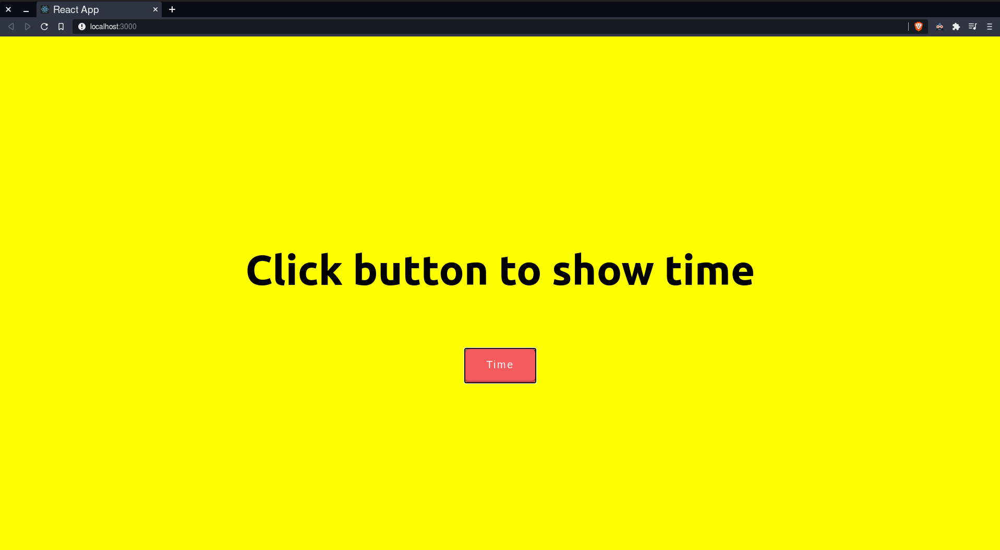

### Time Application

This is a clock which can be enabled or disabled using a button.
# Time Application
> This is a clock which can be enabled or disabled using a button.

## Table of contents
* [General info](#general-info)
* [Screenshots](#screenshots)
* [Technologies](#technologies)
* [To-do list](#to-do-list)
* [Status](#status)
* [Contact](#contact)

## General info
I made this clock beacuse I wanted to practice working with React. The stateful and stateless componene system and saving and changing state.

## Screenshots

## Technologies
* React.JS
* CSS
* HTML

## To-do List:
* Add timer functionality
* Make UI more pleasant

## Status
Project is: _in progress_

## Contact
Created by [@goku-kun](https://www.github.com/Goku-kun/) - feel free to contact me!
