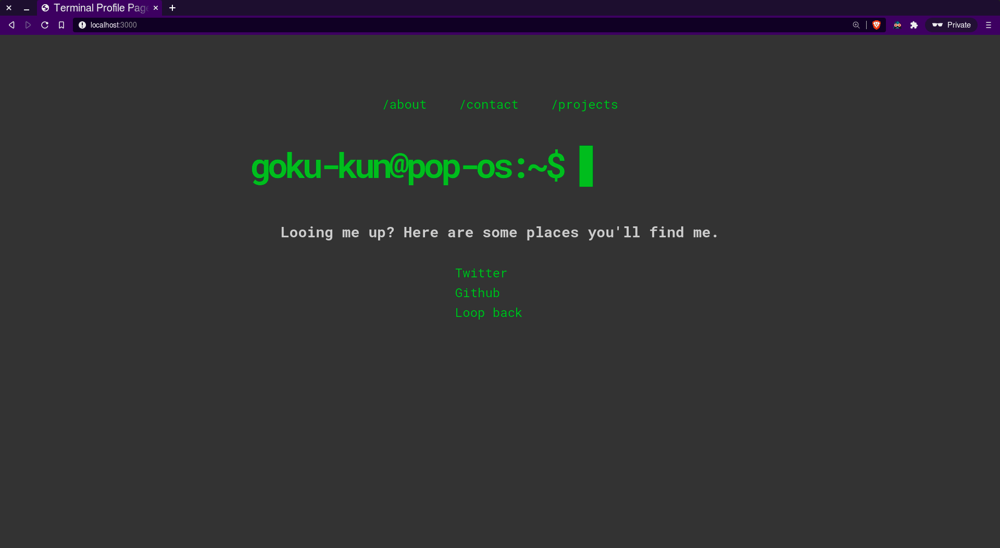

# Terminal look-alike landing page
> Outline a brief description of your project.
> Live demo [_here_](https://www.goku-kun.github.io/terminal-landing-page).

## Table of Contents
* [General Info](#general-information)
* [Technologies Used](#technologies-used)
* [Screenshots](#screenshots)
* [Setup](#setup)
* [Project Status](#project-status)
* [Room for Improvement](#room-for-improvement)
* [Acknowledgements](#acknowledgements)
* [Contact](#contact)
 * [License](#license) 

## General Information
- This project contains a profile landing page for flaunting user profile.

## Technologies Used
- Tech 1 - HTML
- Tech 2 - CSS
- Tech 3 - JS, window.js library

## Screenshots

## Setup
No requirements. Just pop open the `index.html` file in your browser and you're good to go.

## Project Status
Project is: _in progress_ 

## Room for Improvement

Room for improvement:
- Mobile responsiveness

To do:
- add and remove action listeners for a specific condition.

## Acknowledgements
- This project was inspired by various terminal based landing pages.

## Contact
Created by [@goku-kun](https://www.github.com/Goku-kun) - feel free to contact me!

<!-- Optional -->
## License 
This project is open source and available under the [... License](./LICENSE).

